# Interactive Decision Tree Builder Plugin

The Interactive Decision Tree Builder plugin allows to manually create decision trees and use them to score and evaluate datasets.

## Description

This plugin offers one visual webapp to build a decision tree step by step, and two visual recipes to score and evaluate datasets using a decision tree made with the aforementioned webapp.
- [Build and save a decision tree (webapp)](#interactive-decision-tree-builder-webapp)
- [Score a dataset using a saved decision tree made with the webapp (recipe)](#score-recipe)
- [Evaluate a dataset using a saved decision tree made with the webapp (recipe)](#evaluate-recipe)

## When to use this plugin

The webapp can be used for exploratory analysis, to come up with new ideas for feature engineering or to better understand the content of unfamiliar datasets.

Specific business rules can be implemented, and effectively compared with results from Machine Learning algorithms thanks to the two recipes.

It can also be used to interactively bin data.

This plugin can be used for binary or multiclass classification, but does **NOT** yet support regression.

## Interactive Decision Tree Builder webapp

Use this webapp to create and visualize decision trees.

### Settings
- **Folder (required):** The webapp requires a folder to save and load trees. The webapp **will not start** while this setting is not set.

### Getting started

From the landing page of the webapp, one can either create a new tree or load a previously saved one.

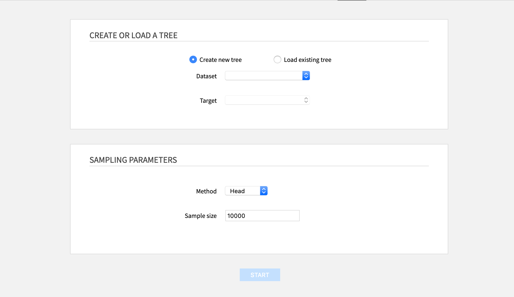

#### Create or load a tree

- **Create a new tree:** Requires to select a dataset and a target. Shared datasets **cannot** be used.
- **Load an existing one:** Requires to select the file where the tree was saved. The file must be saved within the folder used in the settings of the webapp.

#### Sampling parameters

- **Method:** The sampling method used on the dataset.
    - _Head (default):_ the first N rows
    - _Random:_ random sample of approximately N rows
    - _Full:_ all the rows (this is **not** recommended for bigger datasets)
- **Sampling size:** The number N of rows for the sampling method (_Head_ or _Random_ methods)

### Building a decision tree

The webapp has three modes: one to edit the tree, and two to visualize it.

**Toolbar actions**

The toolbar is present in every mode of the webapp, always on the top of the screen.

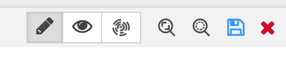

It allows to perform the following general actions:
- **Switch between modes** (edit, tree visualization, sunburst visualization).
- **Zoom fit (edit and tree visualization modes only):** Adjust the zoom scale to display the whole tree on the screen.
- **Zoom 100% (edit and tree visualization modes only):** Center on the selected node and unzoom.
- **Save as...:** Save to a JSON file stored at the root of the folder of the webapp. The icon is blue if there are unsaved changes, grey otherwise. Saving a tree with an already existing name will overwrite the previously saved tree.
- **Close tree:** Go back to the creation/load tree interface.

**Modes of the webapp**

1. Edit mode

The decision tree builder opens in **edit mode**, with the root node selected.

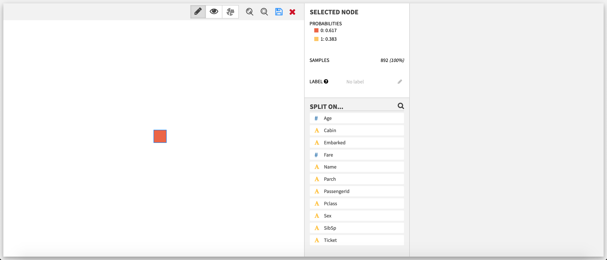

The edit mode allows the user to progressively build a tree from the root by [creating splits](#creating-splits).

**Select a node**

After a node is selected, the **Selected node** section updates with various information:
- The probabilities of the different target classes, in decreasing order. The first class in this list is the prediction for the node.
- The number of samples.
- (Not displayed for the root node) The decision rule.
- (Optional)(Only if the selected node is a leaf, ie. has no children nodes) The label. It is the only field that is editable. Once created, the label of a node is displayed below it. Labels are added as additional information to your samples in the [score](#score-recipe) and [evaluate](#evaluate-recipe) recipes. They can be used for tagging, grouping different predictions or replace/provide more information on the prediction value for example.

**Available actions if the selected node is a leaf**

If the selected node is a leaf, the list of features is displayed below the **Selected node** section. This list can be filtered by clicking on the magnifying glass and using the search bar that subsequently appears.

_Add a split_ Clicking on one of the features opens the [split editor](#creating-splits).

**Available actions if the selected node has already splits**

If the selected node is not a leaf, the feature used for the splits on the node and the list of these splits are displayed below the **Selected node** section.

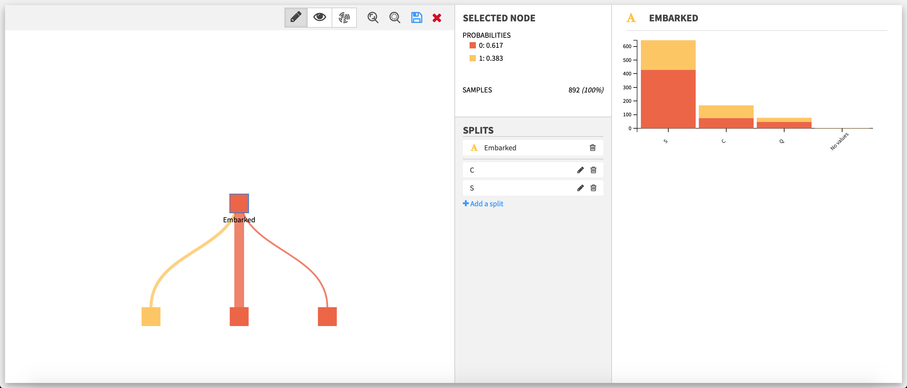

_Add a split_ Clicking on **Add a split** below the split list opens the [split editor](#creating-splits). Auto creation of splits will be disabled.

_Edit a split_ Clicking on the pencil of a split opens the [split editor](#creating-splits).

_Delete a split_ Clicking on the bin of a split deletes it.

_Delete all splits on a node__ Only available if the node as two or more splits. Clicking on the bin next to the name of the feature chosen for the splits will delete all the splits at once.

#### Creating splits

A split can be seen as a rule to separate the data between nodes, according to the value of one of the features of the dataset. In the decision tree builder, the features are treated as either categorical or numerical. As such, two types of splits are possible (categorical and numerical).
To create N nodes, one has to create N-1 split.

For instance:
- **Categorical:** splitting on `Cat` for the feature `Animal` will create two nodes (`Animal` is `Cat` and `Animal` is not `Cat`); splitting on `Cat` and on `Dog` will create three nodes (`Animal` is `Cat`, `Animal` is `Dog` and `Animal` is neither `Cat` nor `Dog`).

- **Numerical:** splitting on 5 for the feature `Age` will create two nodes (`Age` < 5 and 5 ≤ `Age`); splitting on 5 and 10 for the feature `Age` will create three nodes (`Age` < 5, 5 ≤ `Age` < 10 and 10 ≤ `Age`).

Note that for numerical features, missing values are replaced with the mean.

The split editor varies depending of the type of the feature on which the split is being created or edited.

**Split editor on a categorical feature**

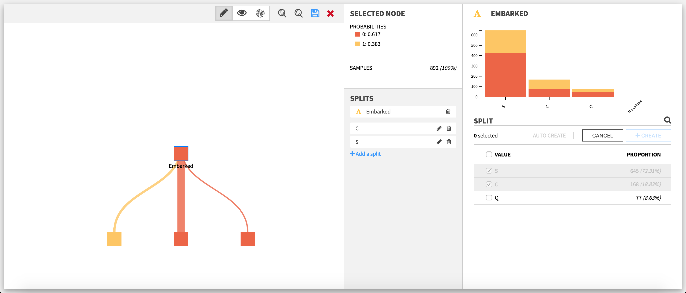

The upper part is a **stacked histogram** of the target distribution across the values of the feature. Only the ten bins with the most samples are represented, in decreasing order.

The lower part is the editor itself.
To **create or edit a split**, one has to select one or more values in the list of the values taken by the feature. This list can be filtered by clicking on the magnifying glass on top and using the search bar that subsequently appears. A split **cannot** take a value that has already been selected by another split on the same node; the value must first be unselected from this other split.

**Split editor on a numerical feature**

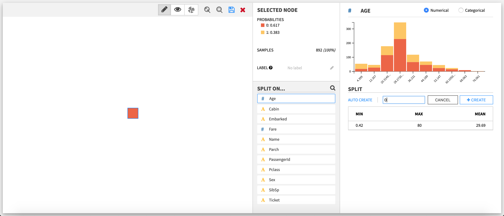

If the selected node is a leaf, there is one extra action available in the split editor of a numerical feature: **switching between types** (ie. the way the plugin treats the feature: categorical or numerical).

The upper part is a **stacked histogram** of the target distribution across the values of the feature. The data is divided between up to ten bins.

The lower part is the editor itself.
To **create or edit a split**, one has to enter a numerical value.

**Auto-creation of splits**

For both categorical and numerical splits, the user can choose to let the webapp backend compute automatically splits, by clicking on **Auto create**, and then entering the number of maximum desired splits.

Auto creation is **not** available when:
- the node already has splits
- the target takes one value or less in the sample of the selected node
- the target distribution is the same across the different values of the feature (for categorical splits)

2. Tree visualization mode

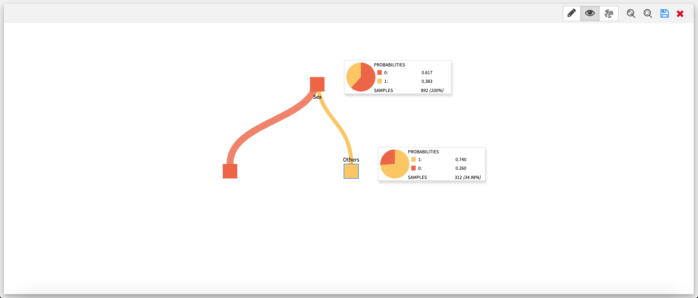

This visualization mode features the tree of the edit mode in a full screen view.
Every node of the tree has a tooltip displaying its main information (probabilities, samples), along with a pie chart of the target distribution.

3. Sunburst visualization mode

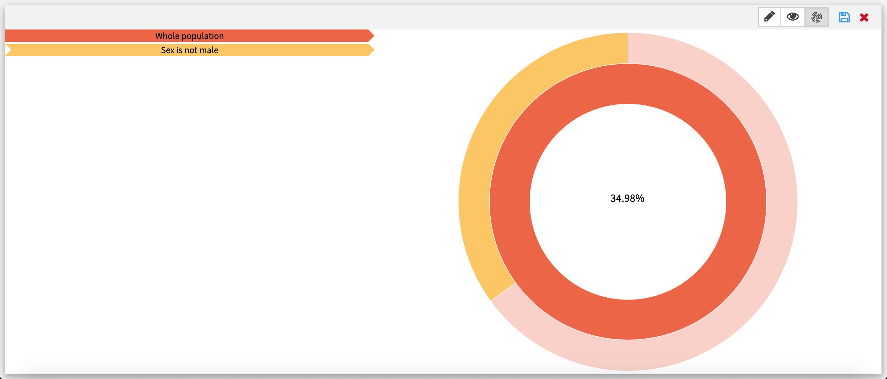

This visualization mode features the tree as a sunburst, with every arc corresponding to a node of the tree from the edit mode. When hovering upon an arc, the decision rule is displayed on the left. Clicking on an arc puts the selected arc in the center of the sunburst.

Since the size of an arc is proportional to the number of samples it has, some arcs may be too small to be displayed.

## Score recipe

Use this recipe to score a dataset, using a decision tree made in the webapp as the prediction model.

_Inputs_
- Dataset with at least all the columns used by the decision tree. If the decision tree uses a numerical feature that has missing values in the input dataset, they are replaced with the mean of the feature in the dataset used to build the tree.
- Folder containing a decision tree from the Interactive Decision Tree Builder webapp

_Output_
- Scored dataset with the same data as the input dataset with extra columns:
    - Prediction
    - Probability of each class
    - (Optional) Label

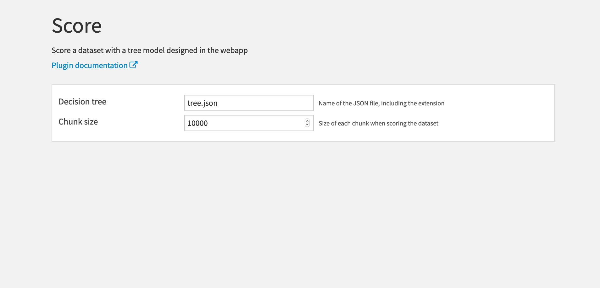

### Settings

- **Decision tree:** The name of the JSON file where the decision tree is saved. Note that you must include the **.json** extension as well.
- **Chunk size:** The number of rows in each scoring batch.

## Evaluate recipe

Use this recipe to score a dataset, using a decision tree made in the webapp as the prediction model.

_Inputs_
- Dataset with at least all the columns used by the decision tree and the target column of the decision tree. If the decision tree uses a numerical feature that has missing values in the input dataset, they are replaced with the mean of the feature in the dataset used to build the tree.
- Folder containing a decision tree from the Interactive Decision Tree Builder webapp.

_Outputs_
- Evaluated dataset: the same dataset as in the input but with extra columns:
    -  Prediction
    - (Optional) Probability of each class
    -  Whether the prediction was correct
    - (Optional) Label

- Metrics dataset

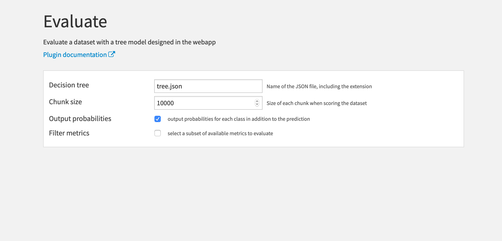

### Settings

- **Decision tree:** The name of the JSON file where the decision tree is saved. Note that you must include the **.json** extension as well.
- **Chunk size:** The number of rows in each evaluation batch.
- **Output probabilities:** Whether to output the probabilities of each class in the evaluated dataset. Checked by default.

- **Filter metrics:** Whether to compute a subset (or no) metrics. Unchecked by default (ie. all the available metrics will be computed to build the metrics dataset).

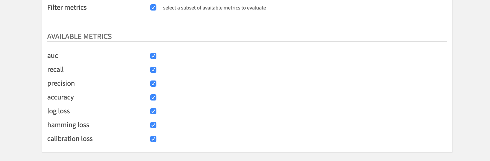

  - **Available metrics:**
    - auc
    - recall
    - precision
    - accuracy
    - log loss
    - hamming loss
    - calibration loss

# License

The Interactive Decision Tree Builder plugin is:

   Copyright (c) 2019 Dataiku SAS
   Licensed under the [MIT License](LICENSE.md).
